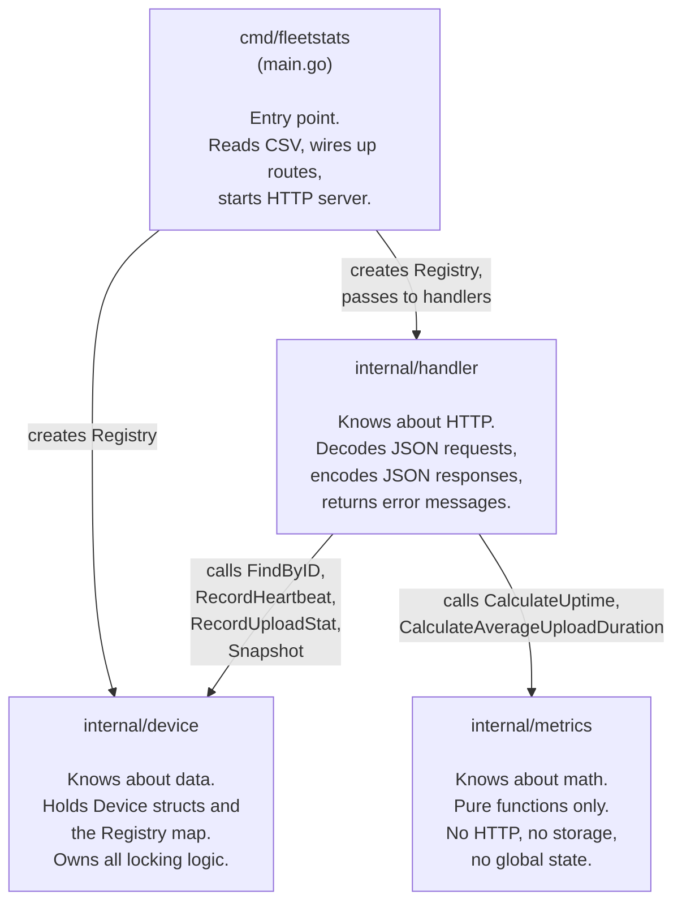
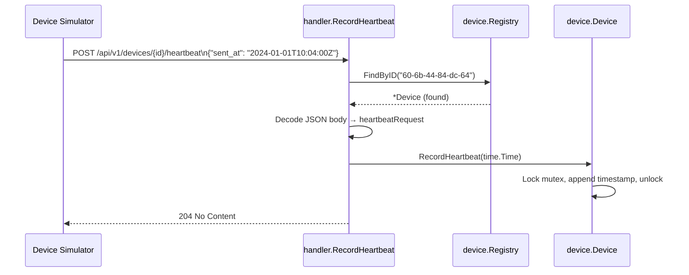
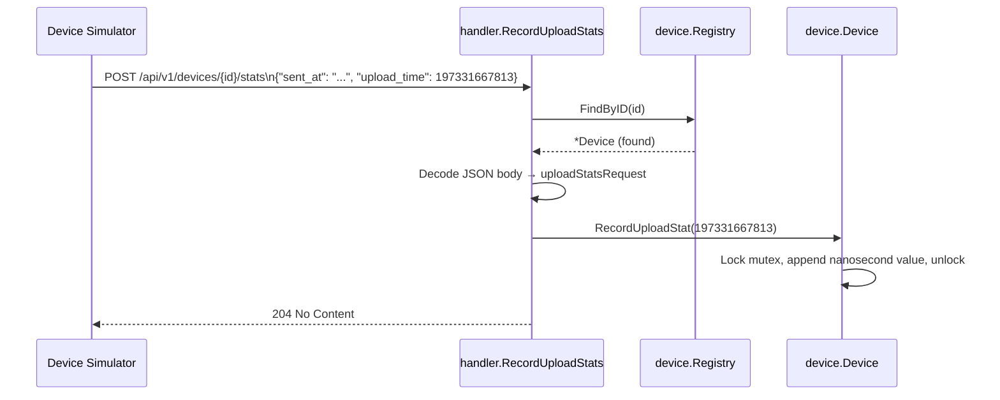
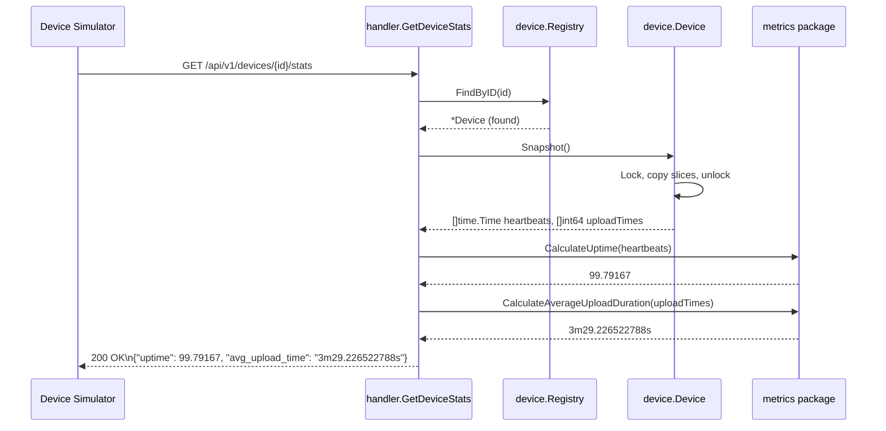
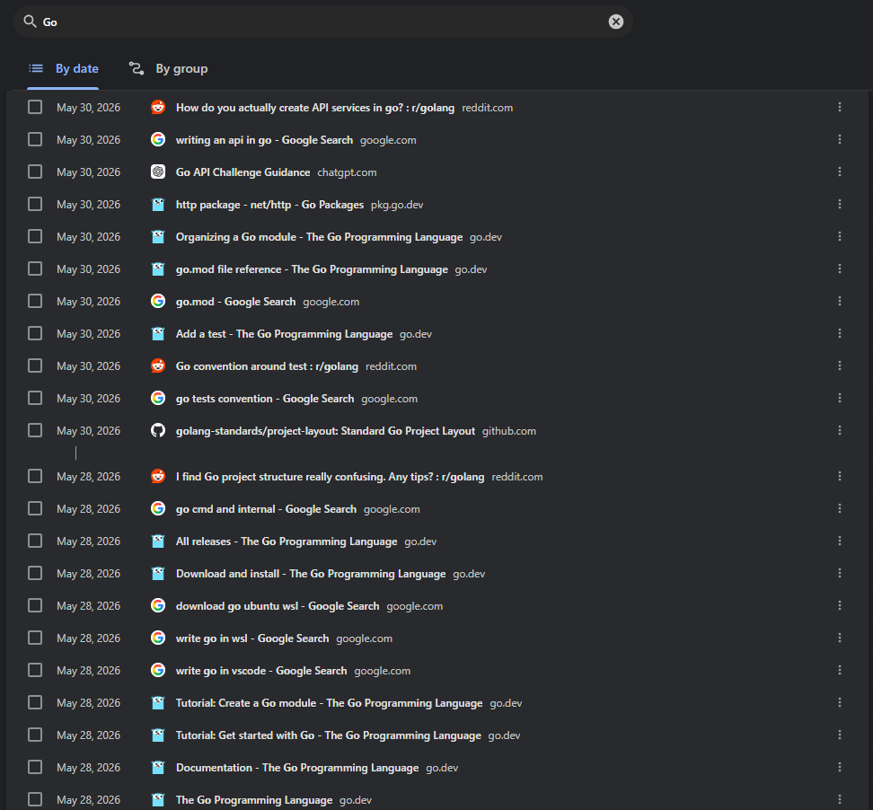
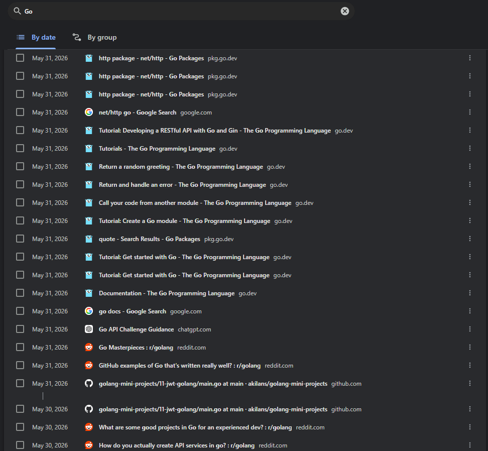

# Fleet Stats Service

An HTTP server that receives telemetry from a fleet of edge devices and exposes per-device uptime and average upload time statistics. Built as a submission for the SafelyYou Monitoring the Fleet coding challenge.

## Contents

- [How to Run](#how-to-run)
- [API Endpoints](#api-endpoints)
- [Project Structure](#project-structure)
- [Package READMEs](#package-readmes)
- [Architecture Overview](#architecture-overview)
- [Request Lifecycle](#request-lifecycle)
- [Simulator Results](#simulator-results)
- [Solution Write-Up](#solution-write-up)

---

## How to Run

```bash
# From the repo root
go run ./cmd/fleetstats -devices devices.csv

# Then, in a second terminal, run the device simulator
./device-simulator-linux-amd64 --port 6733
```

The server listens on port **6733** by default (as required by the OpenAPI contract). Results are written to `results.txt`.

## API Endpoints

| Method | Path | What it does |
|--------|------|-------------|
| `POST` | `/api/v1/devices/{device_id}/heartbeat` | Device reports that it is alive |
| `POST` | `/api/v1/devices/{device_id}/stats` | Device reports a video upload duration |
| `GET`  | `/api/v1/devices/{device_id}/stats`  | Query computed uptime % and avg upload time |

---

## Project Structure

```
sy_code_challenge/
├── cmd/
│   └── fleetstats/
│       └── main.go          ← entry point: startup, flags, routing
├── internal/
│   ├── device/
│   │   └── device.go        ← data model: Device struct + in-memory Registry
│   ├── metrics/
│   │   └── metrics.go       ← pure math: uptime and avg upload time calculations
│   └── handler/
│       └── handler.go       ← HTTP layer: JSON in/out, routing helpers, error responses
├── devices.csv              ← list of known device IDs
├── openapi.json             ← API contract
└── results.txt              ← simulator output from last run
```

---

## Package READMEs

Each package has its own README covering its types, methods, and design decisions.

| Package | Description | README |
|---------|-------------|--------|
| `cmd/fleetstats` | Entry point: startup, flags, routing | [cmd/fleetstats/README.md](cmd/fleetstats/README.md) |
| `internal/device` | Data model: Device struct, in-memory Registry, all locking | [internal/device/README.md](internal/device/README.md) |
| `internal/metrics` | Pure math: uptime and avg upload time calculations | [internal/metrics/README.md](internal/metrics/README.md) |
| `internal/handler` | HTTP layer: request handling, JSON, error responses | [internal/handler/README.md](internal/handler/README.md) |

---

## Architecture Overview

This diagram shows how the four packages depend on each other. Arrows mean "imports / calls into."



---

## Request Lifecycle

### POST /heartbeat - device checks in



### POST /stats - device reports upload duration



### GET /stats - simulator queries results



---

## Simulator Results

All five devices matched expected values exactly.

```
DeviceID: 18-b8-87-e7-1f-06
    Uptime        Expected: 98.75000   Actual: 98.75000  ✓
    AvgUploadTime Expected: 3m17.331667813s  Actual: 3m17.331667813s  ✓

DeviceID: 38-4e-73-e0-33-59
    Uptime        Expected: 99.79167   Actual: 99.79167  ✓
    AvgUploadTime Expected: 3m29.226522788s  Actual: 3m29.226522788s  ✓

DeviceID: 60-6b-44-84-dc-64
    Uptime        Expected: 99.79167   Actual: 99.79167  ✓
    AvgUploadTime Expected: 3m7.893379134s   Actual: 3m7.893379134s   ✓

DeviceID: b4-45-52-a2-f1-3c
    Uptime        Expected: 100.00000  Actual: 100.00000 ✓
    AvgUploadTime Expected: 3m19.085533836s  Actual: 3m19.085533836s  ✓

DeviceID: 26-9a-66-01-33-83
    Uptime        Expected: 92.91667   Actual: 92.91667  ✓
    AvgUploadTime Expected: 3m21.858747766s  Actual: 3m21.858747766s  ✓
```

---

## Solution Write-Up

### How long did you spend working on the problem? What was the most difficult part?

I spent roughly 15 hours on this project. I would have liked to have spent more time refining, but I was under tight time constraints due to work obligations over the weekend.

As discussed in my first interview, I have never worked with (nor even seen a line of) Go before this assignment. Followingly, the most difficult part for me was learning enough Go to know how to begin, granted a narrow window of time to complete the assignment. The core engineering concepts in the project are all comfortably familiar to me - REST APIs and request/response handling, pointers/in-memory storage, and synchronization primitives - but figuring out how to implement these concepts in a new language, under a tight time crunch, was challenging. 

I ultimately used a considerable amount of AI tooling to complete the project, which I want to be fully transparent about. I initially began by working through some of the Go starter tutorials, and then started writing a manual solution using ChatGPT to source relevant Go documentation and other reasonable online resources as needed. However, after being asked to work over the weekend, I eventually started using Claude Code to produce a higher-quality working solution more quickly, and pivoted to treating the resultant project as a focused Go learning resource. I (manually) audited the codebase several times over, cross-referencing all unfamiliar syntax, idioms, and otherwise uncertain Go concepts with the official Go documentation (as well as various other online resources).

Using AI this heavily on a take-home is not how I'd normally prefer to approach this kind of assessment. But (aforementioned time constraints aside) given the current landscape of software development, I do think this approach is more authentic to the reality of software development in 2026 for anyone wishing to remain competitive in the market, and going against the grain in this respect feels increasingly non-competitive. Either way, I'd rather demonstrate that I can work effectively/create robust software quickly with these tools than provide a rushed incomplete manual solution.

For the sake of integrity, here are some screenshots of the Go-related resources I referenced/learned from while I worked through and audited the project (specific links can be provided if anyone is interested):





### How would you modify the data model to support more metric types?

The current `Device` struct has two concrete fields - one for heartbeats, one for upload times. Adding a third metric today means touching the struct, adding a new method, a new handler, and a new calculation function. A more extensible design could use a generic sample store keyed by metric name:

```go
type MetricSample struct {
    RecordedAt time.Time
    Value      float64
}

type Device struct {
    ID      string
    samples map[string][]MetricSample  // "heartbeat", "upload_time", "battery_level", etc.
    mu      sync.Mutex
}
```

Paired with a registered calculator map, adding a new metric becomes: write one calculation function, add one route. The `Device` struct never changes.

**The bigger long-term change would be to move to a database.** In-memory storage works fine for a small fleet over a short window (or perhaps on a supercomputer for a small specialized fleet), but it doesn't scale - at one heartbeat per minute per device, 30,000+ devices running for a year would need hundreds of gigabytes of RAM just for heartbeat data alone.

*(As a side note - the "30,000" number I'm referencing herein is just based on the number we discussed in our initial interview).*

PostgreSQL would be my first choice - partly because it handles time-series data well and scales comfortably to millions of rows with proper indexing, but honestly also because it's what I know best. I've built a multi-tenant Postgres database for fleet edge-AI devices in my current role, so this domain feels familiar. I'd be open to a better fit if one exists for the specific requirements, but Postgres is where I'd start. The result is the same query capability with a fraction of the memory footprint, and adding a new metric type becomes as simple as a new table and a new route - existing code is untouched.

### Runtime Complexity

| Endpoint | Time | Notes |
|----------|------|-------|
| `POST /heartbeat` | O(1) amortized | Slice append; Go doubles capacity as needed |
| `POST /stats` | O(1) amortized | Same |
| `GET /stats` | O(H + U) | H = heartbeat count, U = upload count - one linear pass each |

The real complexity concern is **memory, not time**. Storing every raw heartbeat forever means memory per device grows without bound: 1 heartbeat/min × 1 year × 24 bytes = ~12 MB per device. Across 30,000 devices that's more than 350 GB in one year. The production fix is to store running aggregates instead of raw slices:

```go
// O(1) memory per device regardless of how long it has been running
type DeviceStats struct {
    MinutesWithHeartbeat   int64
    TotalMinutesObserved   int64
    TotalUploadNanoseconds int64
    UploadCount            int64
}
```

`GET /stats` then becomes O(1) - two divisions rather than iterating over slices. The tradeoff is you lose the ability to recompute with a changed formula or query historical windows.

### On Concurrency and Scale

The locking design handles 30,000 devices well as written:

- **Per-device mutexes** mean writes to different devices never compete. All 30,000 devices can receive telemetry simultaneously.
- **`sync.RWMutex` on the Registry** means all stat queries run in parallel; only CSV loading (a one-time startup write) needs exclusive access.
- **Snapshot-then-compute** keeps the lock held only for a memory copy, never for the math. Lock contention approaches zero.

The only structural bottleneck at very high device counts would be the initial `LoadFromCSV` write lock, which is held while populating the map. With 30,000 entries this takes microseconds - not a concern in practice.

