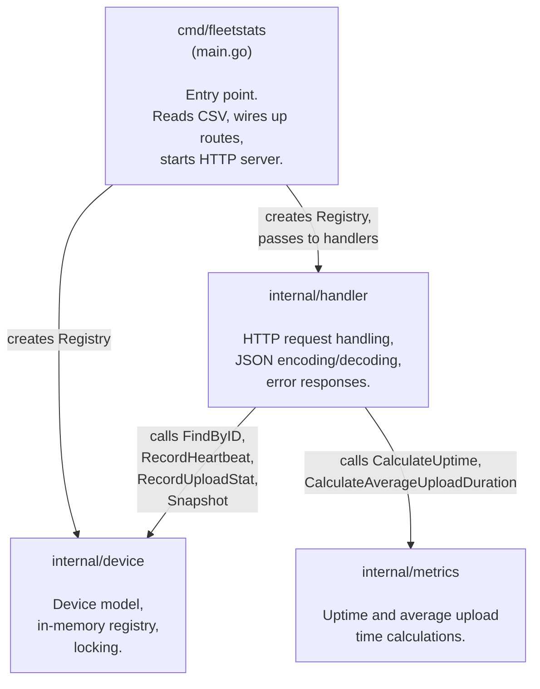
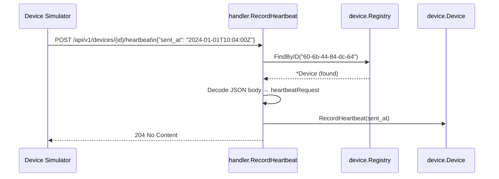
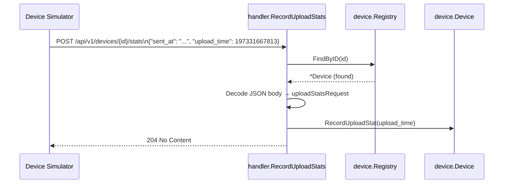
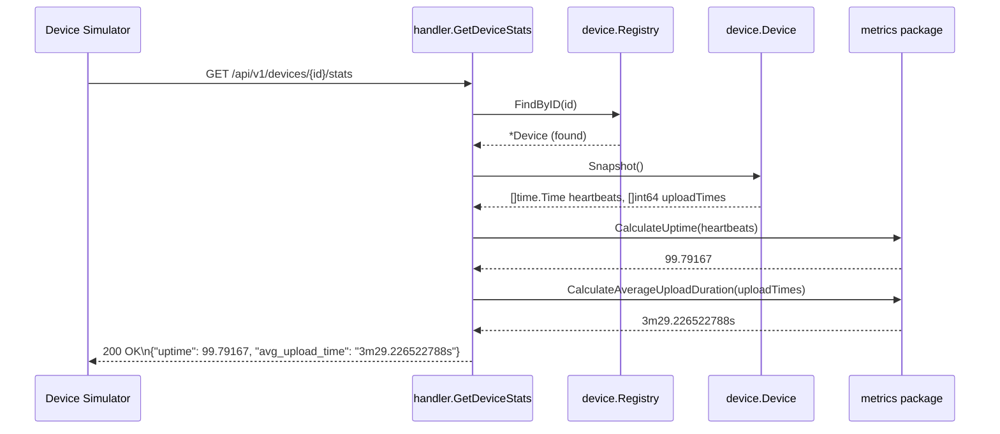

# Fleet Stats Service

An HTTP server that receives telemetry from a fleet of edge devices and exposes per-device uptime and average upload time statistics. Built as a submission for the SafelyYou Monitoring the Fleet coding challenge.

## Contents

- [How to Run](#how-to-run)
- [API Endpoints](#api-endpoints)
- [Project Structure](#project-structure)
- [Package READMEs](#package-readmes)
- [Architecture Overview](#architecture-overview)
- [Request Lifecycle](#request-lifecycle)
- [Simulator Results](#simulator-results)
- [Solution Write-Up](#solution-write-up)

---

## How to Run

```bash
# From the repo root
go run ./cmd/fleetstats -devices devices.csv

# Then, in a second terminal, run the device simulator
./device-simulator-linux-amd64 --port 6733
```

The server listens on port **6733** by default (as required by the OpenAPI contract). Results are written to `results.txt`.

## API Endpoints

| Method | Path | What it does |
|--------|------|-------------|
| `POST` | `/api/v1/devices/{device_id}/heartbeat` | Device reports that it is alive |
| `POST` | `/api/v1/devices/{device_id}/stats` | Device reports a video upload duration |
| `GET`  | `/api/v1/devices/{device_id}/stats`  | Query computed uptime % and avg upload time |

---

## Project Structure

```
sy_code_challenge/
├── cmd/
│   └── fleetstats/
│       └── main.go          ← entry point: startup, flags, routing
├── internal/
│   ├── device/
│   │   └── device.go        ← data model: Device struct + in-memory Registry
│   ├── metrics/
│   │   └── metrics.go       ← pure math: uptime and avg upload time calculations
│   └── handler/
│       └── handler.go       ← HTTP layer: JSON in/out, routing helpers, error responses
├── devices.csv              ← list of known device IDs
├── openapi.json             ← API contract
└── results.txt              ← simulator output from last run
```

---

## Package READMEs

Each package has its own README covering package responsibilities and notable implementation details.

| Package | Description | README |
|---------|-------------|--------|
| `cmd/fleetstats` | Entry point: startup, flags, routing | [cmd/fleetstats/README.md](cmd/fleetstats/README.md) |
| `internal/device` | Data model: Device struct, in-memory Registry, all locking | [internal/device/README.md](internal/device/README.md) |
| `internal/metrics` | Pure math: uptime and avg upload time calculations | [internal/metrics/README.md](internal/metrics/README.md) |
| `internal/handler` | HTTP layer: request handling, JSON, error responses | [internal/handler/README.md](internal/handler/README.md) |

---

## Architecture Overview

This diagram shows how the four packages depend on each other. Arrows mean "imports / calls into."



---

## Request Lifecycle

### POST /heartbeat - device checks in



### POST /stats - device reports upload duration



### GET /stats - simulator queries results



---

## Simulator Results

The device simulator matched expected uptime and average upload-time values for all five devices. Full simulator output is in `results.txt`.

## Solution Write-Up

The assignment write-up is in [SOLUTION_WRITEUP.md](SOLUTION_WRITEUP.md).
