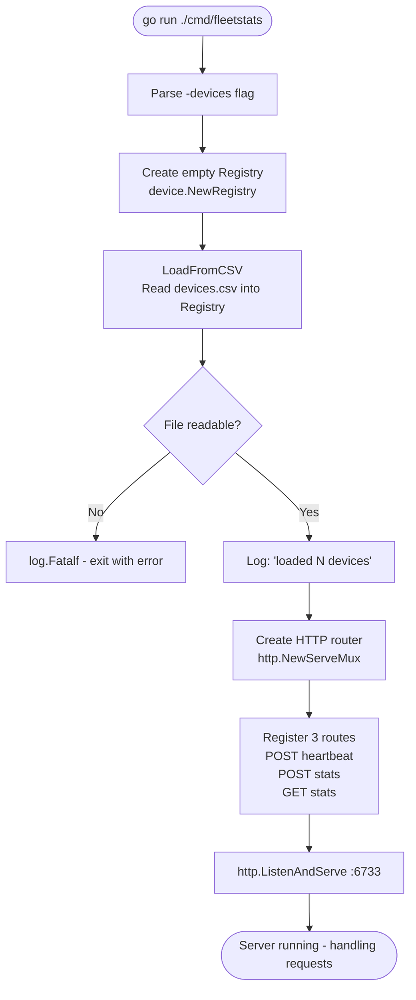

# cmd/fleetstats

The entry point for the Fleet Stats service. Its job is narrow: read configuration, wire the pieces together, and start listening. All real logic lives in the `internal/` packages.

---

## How to Run

```bash
# From the repo root
go run ./cmd/fleetstats -devices devices.csv

# Or build a binary first:
go build -o fleetstats ./cmd/fleetstats
./fleetstats -devices devices.csv
```

### Flags

| Flag | Default | Description |
|------|---------|-------------|
| `-devices` | `devices.csv` | Path to the CSV file listing all known device IDs |

---

## Startup Sequence



---

## What `main.go` Does, Line by Line

### Constants

**`serverPort`** - The port the HTTP server listens on (`6733`). Set by the OpenAPI contract; changing it breaks the simulator.

**`apiBasePath`** - The URL prefix shared by all three routes (`/api/v1`). Defined once so all route registrations stay in sync.

### `main()`

**`deviceCSVPath`** - Holds the value of the `-devices` flag. Using a flag rather than a hardcoded path means the binary runs in different environments without code changes.

**`flag.Parse()`** - Reads command-line arguments and fills in registered flag variables.

**`deviceRegistry`** - The single shared store for all device data. Created once here and passed into each HTTP handler so all three handlers operate on the same data.

**`requestRouter`** - The HTTP router. Matches incoming requests by method and path and hands them to the correct handler function.

**Route registration** - Each `HandleFunc` call binds a method+path pattern to a handler. The `{device_id}` segment is a named wildcard the handler retrieves via `r.PathValue("device_id")`.

**`http.ListenAndServe`** - Starts the server and blocks. If it returns, something went wrong — `log.Fatalf` prints the error and exits.
