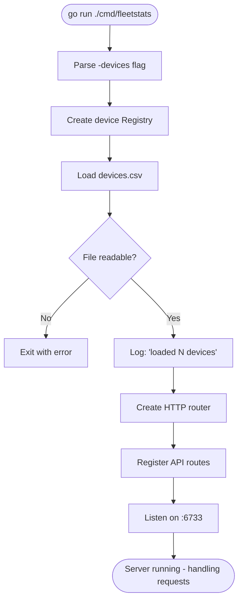

# cmd/fleetstats

The entry point for the Fleet Stats service. Its job is narrow: read configuration, wire the pieces together, and start listening. All real logic lives in the `internal/` packages.

---

## How to Run

```bash
# From the repo root
go run ./cmd/fleetstats -devices devices.csv

# Or build a binary first:
go build -o fleetstats ./cmd/fleetstats
./fleetstats -devices devices.csv
```

### Flags

| Flag | Default | Description |
|------|---------|-------------|
| `-devices` | `devices.csv` | Path to the CSV file listing all known device IDs |

---

## Startup Sequence



---

## Implementation Notes

`main.go` keeps startup wiring in one place:

- The server listens on port `6733`, as required by the OpenAPI contract and device simulator.
- The `-devices` flag selects the CSV file loaded into the registry at startup.
- A single in-memory registry is shared by all handlers.
- Routes are registered under `/api/v1` for heartbeat ingestion, upload-stat ingestion, and stat retrieval.

If device loading fails, startup fails rather than accepting requests with an empty registry.
