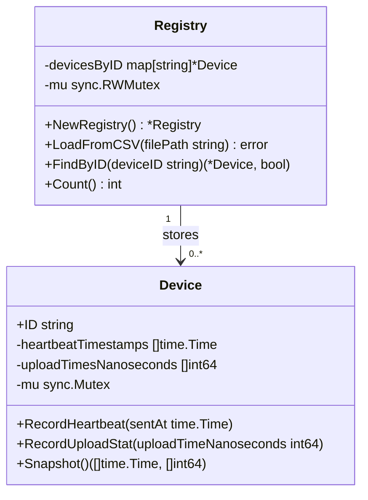
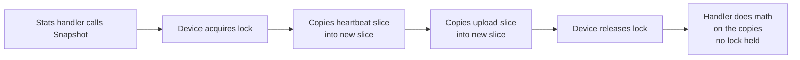
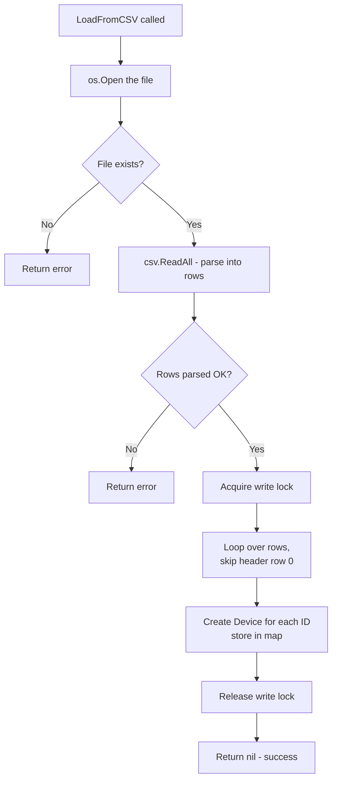

# internal/device

This package owns the **data model** for the service. It defines what a device looks like in memory and provides the registry that stores all of them.

Everything related to safe concurrent access (locking) lives here. No other package needs to think about mutexes.

---

## The Two Types

Standard UML visibility notation: `-` private (unexported), `+` public (exported).

---

## `Device`

Think of a `Device` as a folder for one physical camera or sensor. It holds everything we know about that device: every time it checked in, and every upload duration it has ever reported.

### Fields

**`ID`** - The device's unique string identifier, e.g. `"60-6b-44-84-dc-64"`. Read directly from `devices.csv` on startup.

**`heartbeatTimestamps`** *(private)* - An ever-growing list of timestamps, one entry per heartbeat received. If the device sends a heartbeat every minute for 8 hours, this list will have ~480 entries. Private because callers should use `RecordHeartbeat` and `Snapshot`, not poke at this directly.

**`uploadTimesNanoseconds`** *(private)* - Same idea, but for upload durations. Each entry is a raw nanosecond count. Private for the same reason.

**`mu`** *(private)* - A mutex protecting concurrent writes to `heartbeatTimestamps` and `uploadTimesNanoseconds`. All mutation goes through methods that acquire this lock, so simultaneous requests for the same device take turns rather than racing.

### Methods

**`RecordHeartbeat(sentAt time.Time)`**
Appends one timestamp to the heartbeat list under the device's lock. Called by the heartbeat HTTP handler.

**`RecordUploadStat(uploadTimeNanoseconds int64)`**
Same pattern as `RecordHeartbeat`, but for upload durations. Called by the upload stats HTTP handler.

**`Snapshot() ([]time.Time, []int64)`**
Returns independent copies of both data lists. The lock is held only for the duration of the copy — math happens on the copies outside the lock, so incoming telemetry writes are never blocked by a stats calculation.

---

## `Registry`

Think of the `Registry` as the master directory - a phone book that maps device IDs to their Device objects. It's created once at startup, populated from `devices.csv`, and then lives for the entire lifetime of the server.

### Fields

**`devicesByID`** *(private)* - Map from device ID string to `*Device`. Storing pointers ensures all handlers share the same Device object in memory.

**`mu`** *(private)* - A read/write mutex (`sync.RWMutex`). Multiple concurrent readers (device lookups) never block each other; the write lock is only taken during CSV loading at startup.

### Methods

**`NewRegistry() *Registry`**
Constructor. Returns an empty, initialised registry ready to be populated.

**`LoadFromCSV(filePath string) error`**
Opens the CSV file, reads every row after the header, and creates a `Device` for each device ID found. Returns an error if the file can't be opened or parsed - `main.go` treats this as fatal (no devices = no point running).

**`FindByID(deviceID string) (*Device, bool)`**
Looks up a device by ID. Returns `(device, true)` if found, `(nil, false)` if not. Acquires a read lock so simultaneous lookups never block each other.

**`Count() int`**
Returns how many devices are registered. Used once, at startup, for the log message `"loaded N devices"`.

---

## Why Is This Its Own Package?

1. **Locking logic has one home.** Concurrency bugs have exactly one place to look.
2. **Encapsulation is enforced.** The handler package cannot access `heartbeatTimestamps` directly — it must go through `RecordHeartbeat` and `Snapshot`, which guarantees the mutex is always held correctly.
3. **Testable in isolation.** Device tests need no HTTP server and no CSV file.
