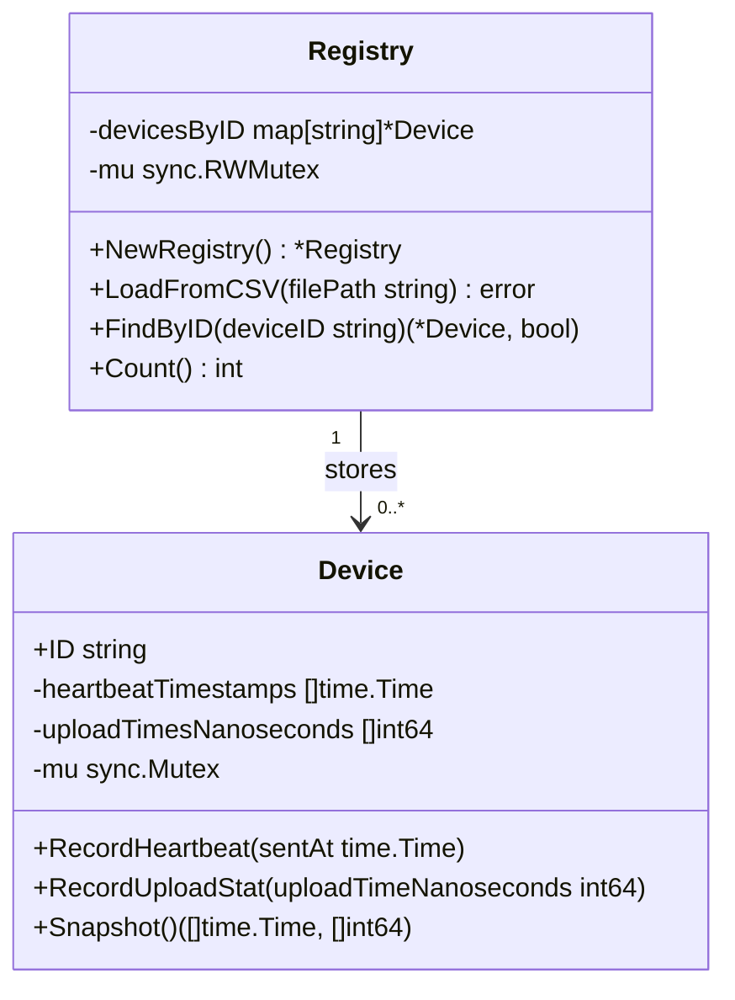

# internal/device

This package owns the in-memory device registry and per-device telemetry storage.

---

## The Two Types

Legend: `+` exported, `-` unexported.

---

## `Device`

A `Device` stores telemetry for one physical camera or sensor: heartbeat timestamps and upload durations. The telemetry slices are protected by a per-device mutex, and callers use `RecordHeartbeat`, `RecordUploadStat`, and `Snapshot` rather than accessing the slices directly.

`Snapshot` returns independent copies of both telemetry slices. Metrics are calculated from those copies so the device lock is held only while copying current state.

---

## `Registry`

The `Registry` maps device ID strings to shared `Device` instances. It is created once at startup, populated from `devices.csv`, and used for the lifetime of the server.

### Fields

**`devicesByID`** *(private)* - Map from device ID string to `*Device`.

**`mu`** *(private)* - A read/write mutex (`sync.RWMutex`). Multiple concurrent readers (device lookups) never block each other; the write lock is only taken during CSV loading at startup.

### Methods

**`NewRegistry() *Registry`**
Constructor. Returns an empty, initialised registry ready to be populated.

**`LoadFromCSV(filePath string) error`**
Opens the CSV file, reads every row after the `device_id` header, and creates a `Device` for each ID found. Returns an error if the file cannot be opened or parsed.

**`FindByID(deviceID string) (*Device, bool)`**
Looks up a device by ID. Returns `(device, true)` if found, `(nil, false)` if not. Acquires a read lock so simultaneous lookups never block each other.

**`Count() int`**
Returns how many devices are registered. Used once, at startup, for the log message `"loaded N devices"`.
