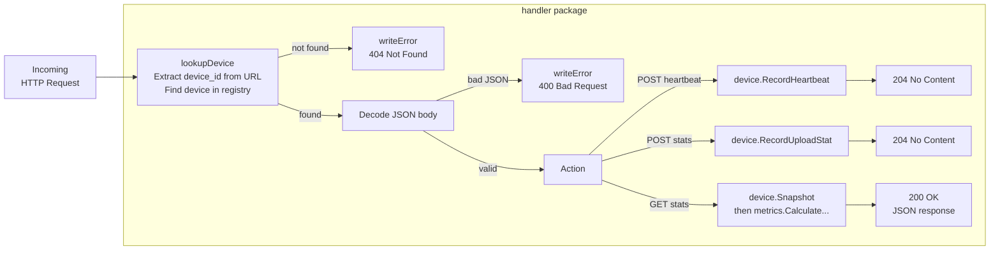
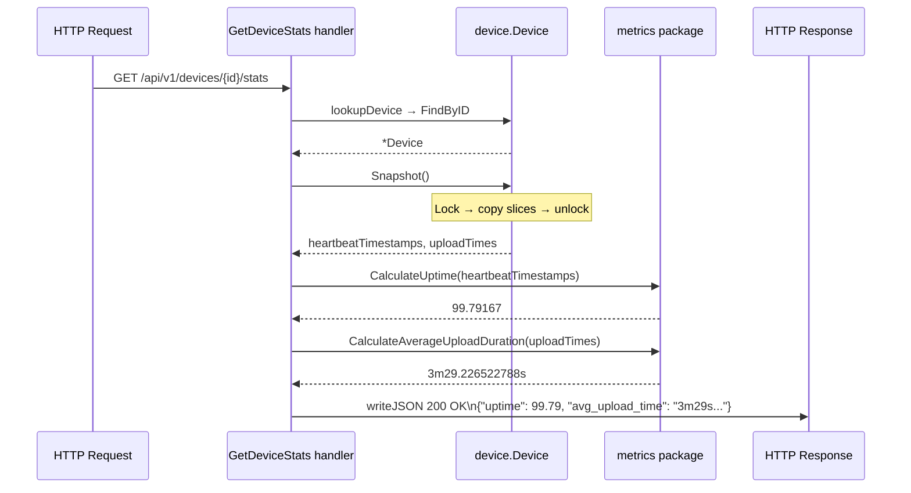

# internal/handler

This package is the **HTTP layer** - the bridge between the outside world (HTTP requests) and the internal logic (device data and metric calculations).

It knows about JSON, HTTP status codes, and URL paths. It does not know about mutexes, CSV files, or how uptime is calculated. Those are someone else's problem.

---

## Overview

---

## Request and Response Types

These structs define the shape of JSON bodies. The `json:"field_name"` tags control key names in serialised JSON — required here because the OpenAPI contract uses snake_case while Go conventions use PascalCase.

### `heartbeatRequest`
The JSON body the device sends to `POST .../heartbeat`.

| Field | JSON key | Type | Meaning |
|-------|----------|------|---------|
| `SentAt` | `sent_at` | `time.Time` | When the device generated this heartbeat |

### `uploadStatsRequest`
The JSON body the device sends to `POST .../stats`.

| Field | JSON key | Type | Meaning |
|-------|----------|------|---------|
| `SentAt` | `sent_at` | `time.Time` | When the device sent this report |
| `UploadTime` | `upload_time` | `int64` | How long the last video upload took, in nanoseconds |

### `deviceStatsResponse`
The JSON body returned by `GET .../stats`.

| Field | JSON key | Type | Meaning |
|-------|----------|------|---------|
| `Uptime` | `uptime` | `float64` | Availability percentage, e.g. `98.75` |
| `AvgUploadTime` | `avg_upload_time` | `string` | Mean upload duration, e.g. `"3m17.331667813s"` |

### `errorResponse`
The JSON body returned with any 4xx or 5xx response.

| Field | JSON key | Type | Meaning |
|-------|----------|------|---------|
| `Message` | `msg` | `string` | Human-readable description of what went wrong |

The OpenAPI contract requires the error key to be `msg` specifically - which is why this struct has a `json:"msg"` tag rather than using the default field name.

---

## Handler Functions

Each handler accepts a `*device.Registry` and returns an `http.HandlerFunc`. The returned function captures the registry from its enclosing scope, so it has access to device data on every request without relying on global state. Each handler is called once at startup to produce the function stored in the router.

### `RecordHeartbeat(deviceRegistry *device.Registry) http.HandlerFunc`

**What it does:** Handles `POST /api/v1/devices/{device_id}/heartbeat`.

Step by step:
1. Extract `{device_id}` from the URL → call `lookupDevice` → 404 if unknown
2. Read and decode the JSON body → `heartbeatRequest` → 400 if malformed
3. Call `device.RecordHeartbeat(sentAt)` to store the timestamp
4. Respond `204 No Content` — the request succeeded; there is no response body.

---

### `RecordUploadStats(deviceRegistry *device.Registry) http.HandlerFunc`

**What it does:** Handles `POST /api/v1/devices/{device_id}/stats`.

Step by step:
1. Extract `{device_id}` → lookup → 404 if unknown
2. Decode JSON body → `uploadStatsRequest` → 400 if malformed
3. Call `device.RecordUploadStat(uploadTime)` to store the nanosecond count
4. Respond `204 No Content`

Same pattern as `RecordHeartbeat`, different request struct and different `Record*` method.

---

### `GetDeviceStats(deviceRegistry *device.Registry) http.HandlerFunc`

**What it does:** Handles `GET /api/v1/devices/{device_id}/stats`.

This is the most complex handler - it actually computes and returns something.

Step by step:
1. Extract `{device_id}` → lookup → 404 if unknown
2. Call `device.Snapshot()` - this copies the device's data under a lock and returns the copies
3. Call `metrics.CalculateUptime(copiedHeartbeats)` - returns a float
4. Call `metrics.CalculateAverageUploadDuration(copiedUploadTimes)` - returns a `time.Duration`
5. Call `.String()` on the duration to get `"3m29.226522788s"` (the format the contract requires)
6. Encode both values into a `deviceStatsResponse` and respond `200 OK` with JSON

---

## Shared Helper Functions

Internal utilities used by the three handlers above.

### `lookupDevice(...) (*device.Device, bool)`

**What it does:** Extracts the `{device_id}` from the URL (using `r.PathValue("device_id")`), looks it up in the registry, and writes a `404` JSON error if it isn't found.

The `bool` return signals success or failure. If it returns `false`, the error response has already been written - the calling handler just needs to `return`.

This helper exists to avoid copy-pasting the same 6 lines of lookup-and-404 at the top of every handler.

### `writeJSON(responseWriter, statusCode, responseBody)`

Sets `Content-Type: application/json`, writes the status code, then encodes the response body as JSON. Headers are set before `WriteHeader` is called — the order matters.

### `writeError(responseWriter, statusCode, message)`

Thin wrapper around `writeJSON` that formats the message as `{"msg": "..."}` — the shape the OpenAPI contract requires for all error responses.
