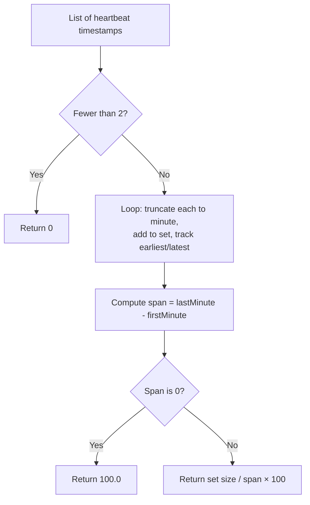

# internal/metrics

Pure calculation functions — no HTTP, no storage, no global state. Input goes in, a number comes out.

---

## Functions

### `CalculateUptime(heartbeatTimestamps []time.Time) float64`

Returns the device's uptime as a percentage.

```
uptime = (minutesWithHeartbeat / totalMinutesInSpan) × 100
```

Each timestamp is truncated to its minute boundary and added to a set, so multiple heartbeats in the same minute count as one. The span is the raw duration from the first minute bucket to the last — not the count of slots (no off-by-one +1).

Returns 0 if fewer than two heartbeats have been received.



---

### `CalculateAverageUploadDuration(uploadTimesNanoseconds []int64) time.Duration`

Returns the arithmetic mean of a list of upload durations as a `time.Duration`, which formats as a human-readable string (`"3m17.331667813s"`) via `.String()`.

Returns 0 if the input slice is empty.
